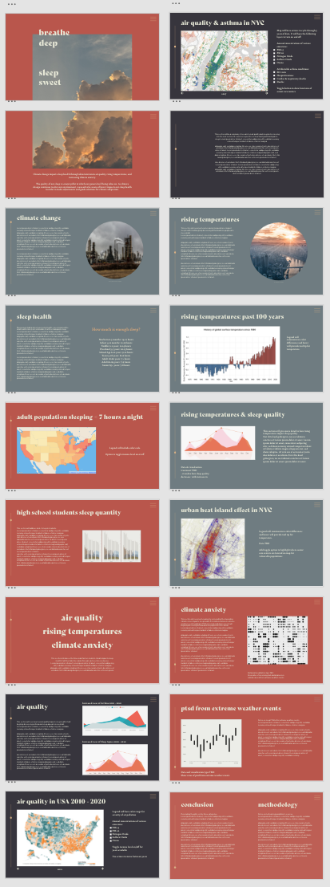

Note: See "Research" readme for additional information

# Thesis Topic: 

The thesis project Climate // Sleep focuses on the implications of the climate crisis on one of our most fundamental human needs: sleep. Climate change impacts sleep health through deterioration in air quality, rising temperatures, and increasing climate anxiety.

### POV: 

The quality of our sleep is a major pillar in which our general well being relies on. As climate change continues to alter our environment, we need to be aware of how it impacts our sleep health in order to make adjustments and guide solutions for climate adaptation.

### Updated Final Wireframe:

For reference, previous concepts:

### Wireframe Option 1: Scrollytelling

### Wireframe Option 2: Discovery

