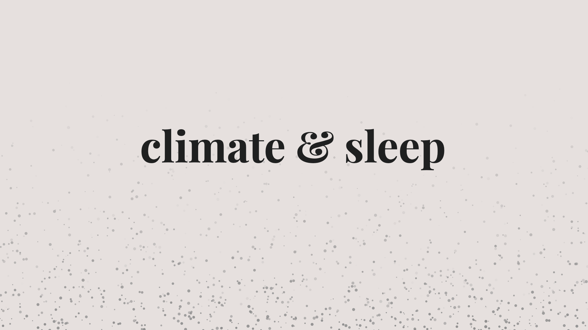

# Climate & Sleep

### Exploring the relationship between the climate crisis and sleep health.

Masters Thesis in Data Visualization from Parsons School of Design, May 2020

By: Amanda Anderson-You

[Visualization Website](https://amandersonyou.github.io/Clima…)

### Abstract: 
Climate & Sleep focuses on the implications of the climate crisis on one of our most fundamental human needs: sleep. As global heating continues to increase and threaten life as we know it, humans are required to evaluate how these changes are impacting their daily lives and adapt accordingly. The Centers for Disease Control and Prevention (CDC) states that adults between the ages of 18 and 60 are recommended to sleep for 7 hours or more a night. Not only is this amount of sleep important, but the quality of one’s sleep is also critical. This thesis evaluates how three factors of the climate crisis coincide with sleep health and investigates what those effects are as they relate to children and adults in the United States. Inspired by Rifkin et al.’s systematic review of the literature and conceptual framework on this topic, I have chosen to research and visualize the relationships between sleep health and the climate crisis by focusing on air quality changes, rising temperatures, and extreme weather climate anxiety. I will be utilizing data from United States government agencies such as the CDC, the National Centers for Environmental Information (NCEI) and the Environmental Protection Agency (EPA) in order to explore the most recent as well as historical data. This project aims to increase understanding of current climate circumstances to improve social well-being. I hope that those who engage with it are able to more easily process the direct links of how global heating impacts our sleep quality. More specifically, I aim to provide visual tools of understanding to the community of people who are working in the fields of climate crisis or sleep health. The climate crisis is inevitable, and the more we’re aware of its impacts on our basic needs, the more adaptable we can become. 

### POV: 

The quality of our sleep is a major pilliar in which our general well being relies on. As climate change continues to alter our environment, we need to be aware of how it impacts our sleep health in order to make adjustments and guide solutions for climate adaptation.

### Audience: 

Environmental policy makers and health care professionals.

### Outline:

#### Introduction:

- Brief overview of climate change
- Brief overview of the importance of sleep
  - How many people affected by sleep disorders leading to sleep deprivation or inadequite sleep
- Thesis question: How does climate change impact sleep health through deterioration in air quality, rising temperatures, and increased climate anxiety?

#### Air Quality:

- What are the primary air pollutants?
  - What are the EPA's standards for air quality?
  - How does climate change impact air pollution?
- How has air quality changed over time for NYC as a case study?
  - Show this visually, chart type TBD
- Where are the areas with the poorest air quality in the US?
  - Show this visually with mapping
  - Add layer showing income levels 
  - If available, add age demographics for elderly and children

#### Impact of Air Pollution on Sleep:

- Respiratory sleep conditions:
  - Asthma
  - Sleep apnea
- How are these impacted by air quality?
- Rates of diagnoses of these conditions over time
  - Show this visually, chart type tbd
- Where are the highest rates of asthma in the US?
  - Tie this into the previous map showing poorest air quality in US
  - Add layer or a seperate visual to show age groups for hospitalizations
- Where are the highest rates of sleep apnea in the US 
  - Add this to asthma visual if it makes sense

#### Impact of Rising Temperatures on Sleep:

- Rising temperatures with global warming
- Sleeping temperature ideal ranges
- The impact of altering sleeping temperatures, thermoregulation
  - Visualize increased severity of obstructive sleep apnea
  - Add layer of higher impact on elderly and low income
  - Commuicate enhanced effect of high temp retention in urban areas

- Briefly touch on other results of rising temperatures that lead to stress and trauma
  - Food and water scarcity
  - Spreading of disease
  - Displacement 

#### Climate Related Anxiety:

- Mental health affected by extreme weather events
- Anxiety related to impending threat of climate change
- Increased cases of insomnia
  - Related to depression and PTSD
  - Sleep deprivation's affect of school age children and adolescents

#### Conclusion:

- Restate thesis and point of view:
  - Climate change impacts sleep health through deterioration in air quality, rising temperatures, and increasing climate anxiety.
  - The quality of our sleep is a major pilliar in which our general well being relies on. As climate change continues to alter our environment, we need to be aware of how it impacts our sleep health in order to make adjustments and guide solutions for climate adaptation.
- Summarize air quality section
- Summarize two complementary sections connecting climate change to sleep health:
  - Rising temperatures
  - Climate related anxiety
- Communicate action for audience: 
  - To recognize climate change's impact on sleep health and understand the repercussions of poor air quality, rising temperatures, and increased climate anxiety on our sleep quality and overall health and well-being.

### Data Resources

- Scholarly Journals
- EPA.gov
- NYC Open Data
- National Institutes of Health (NIH)
- CDC.gov
- Harvard Health Publishing, medical school journal
- National Institute of Mental Health
- Library publications

### User Experience

**Format: Scrollytelling website**
I hope to capture their attention and keep it for the length of the piece. 
To do so I plan to have a bold beginning, and a number of transitions that are engaging to scroll through.

**User Ask:**
Scroll through the website and read the text and the visuals. I’ll include cues to scroll further 
and will include a sticky menu to return to certain sections of the page as you go if desired. 
I hope to make at least one visual interactive in the ability to toggle options on and off and/or 
click/hover on the visual for more information.

