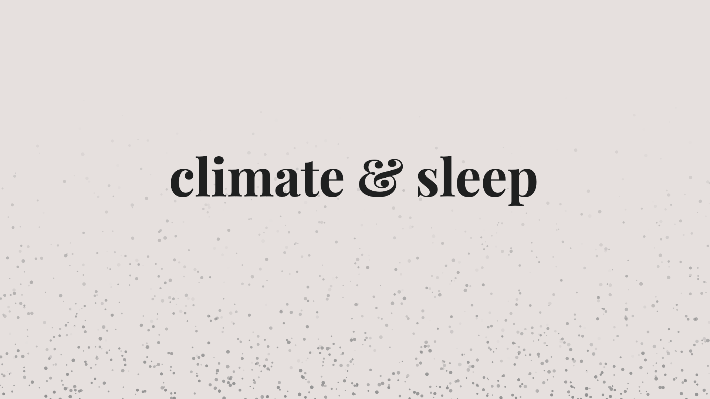
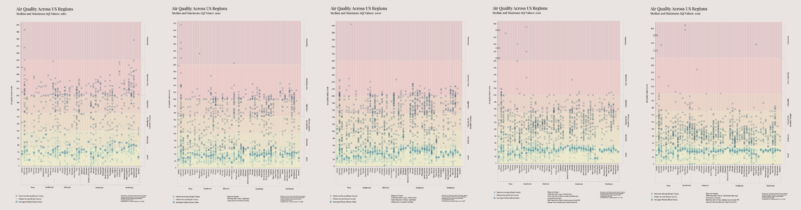

# Climate & Sleep

### Exploring the relationship between the climate crisis and sleep health.

Masters Thesis in Data Visualization from Parsons School of Design, May 2020

By: Amanda Anderson-You

[Project Website](https://amandersonyou.github.io/ClimateSleepThesis)

### Abstract: 
Climate & Sleep visualizes the impact the climate crisis has on one of our most fundamental human needs: sleep. As global heating continues to increase and threaten daily life as we know it, humans are required to evaluate how these changes are impacting their lives and adapt accordingly. One third of Americans report not receiving what is considered sufficient sleep of at least 7 hours a night on average. Not only is this amount of sleep important, but the quality of one’s sleep is also critical. This thesis evaluates how poor air quality and rising temperatures as factors of the climate crisis relate to sleep health in America. I utilize data from United States government agencies such as the Centers for Disease Control and Prevention (CDC), the National Centers for Environmental Information (NCEI) and the Environmental Protection Agency (EPA) in order to explore the most recent as well as historical data. This project aims to increase understanding of current climate circumstances to improve social well-being. The climate crisis is inevitable, and the more we’re aware of its impacts on our basic needs, the more adaptable we can become. 

### Data Sources: 

- [CDC Sleep & Sleep Disorders](https://www.cdc.gov/sleep/data_statistics.html)
- [EPA Air Quality Data](https://www.epa.gov/outdoor-air-quality-data)
- [CDC 500 Cities Data](https://www.cdc.gov/500cities/index.htm)
- [EPA Climate Change Indicators](https://www.epa.gov/climate-indicators/climate-change-indicators-ragweed-pollen-season)
- [CDC Population Health](https://ephtracking.cdc.gov/showPopulationData)
- [CDC Climate Change Tracking](https://ephtracking.cdc.gov/showClimateChangeTracking)

### Visualizations:

### Acknowledgements:
Thank you to all of my fantastic professors at Parsons, specifically Daniel Sauter and Aaron Hill. Thank you also to my wonderfully talented 2020 MSDV cohort for their support, advice, and humor along the way. View all of the graduating students' projects [here](https://parsons.nyc/thesis-2020/).